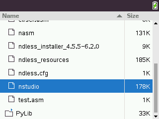

# nStudio

<p align="center">
  
</p>

## About

nStudio is a lightweight, fully-featured ARM assembly Integrated Development Environment (IDE) built specifically for the TI-Nspire CX and CX II calculators running Ndless. It allows developers to write, edit, and navigate ARM assembly code directly on the calculator itself, providing desktop-like text editing capabilities on a portable device.

## Features

* **Gap-Buffer Text Editor**: Highly efficient text insertion and deletion, capable of handling large files without lag.
* **Syntax Highlighting**: Real-time parsing and highlighting for ARM mnemonics, registers, immediates, labels, comments, directives, and string literals.
* **Built-in File Browser**: Navigate the Ndless filesystem, open existing files, and save projects with a clean, themed directory interface.
* **Instruction Catalog**: Integrated offline reference manual for ARM instructions, including argument signatures, descriptions, and CPSR flag effects.
* **Navigation Tools**: Instantly jump to specific lines or browse an auto-generated list of all defined labels in your code.
* **Theme Engine**: Switch between Dark and Light presets, or build a fully custom color scheme directly from the settings menu.
* **Character Map**: Easily insert special symbols and operators that are not readily available on the physical keypad.

## Controls & Shortcuts

### Editor

* **Arrows**: Move cursor
* **Ctrl + Left/Right**: Jump by word
* **Ctrl + Up/Down**: Page up / Page down
* **Ctrl + Shift + Up/Down**: Jump to top / bottom of file
* **Ctrl + S**: Save
* **Ctrl + Shift + S**: Save As
* **Ctrl + O**: Open File
* **Ctrl + G**: Go to Line
* **Ctrl + L**: Open Label Browser
* **Ctrl + M**: Open Menu Bar
* **Ctrl + Catalog (Book Key)**: Open Special Character Map

### File Browser

* **Arrows**: Navigate files and folders
* **Enter**: Enter folder / Open file
* **Tab**: Toggle file filter (show all files vs `.asm.tns` files) / Confirm save destination in "Save As" mode
* **Esc**: Cancel / Close

### Catalog / Cheatsheet

* **Arrows**: Navigate categories and instructions
* **Enter**: Insert the selected mnemonic into the editor
* **Shift + Enter**: Show detailed information about the selected instruction

## Building from Source

To build nStudio from source, you will need the [Ndless SDK](https://github.com/ndless-nspire/Ndless) installed and properly configured on your system.

1. Clone the repository.
2. Ensure the Ndless toolchain binaries (`nspire-gcc`, `nspire-ld`, `genzehn`, `make-prg`) are in your PATH.
3. Run the following command in the project directory:

```bash
make
```

This will produce the `nstudio.tns` executable.

## Installation

1. Transfer the `nstudio.tns` file to your TI-Nspire using the TI-Nspire Student Software, N-Link, or TiLP.
2. Ensure Ndless is installed and active on your calculator.
3. Open `nstudio.tns` from the calculator's native file browser to launch the application. Settings are automatically saved to `/documents/ndless/nstudio.cfg`.

## License

This project is licensed under the GNU General Public License v3.0 (GPLv3).
