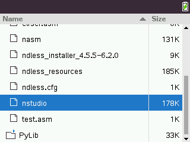

# nStudio

<p align="center">
  
</p>

## About

nStudio is an ARM assembly editor for the TI-Nspire CX and CX II calculators running Ndless. It lets you write, edit, and navigate ARM assembly source directly on the calculator.

## Features

* **Gap-buffer text editor**: Insert and delete without rewriting the whole buffer on each keystroke.
* **Syntax highlighting**: ARM mnemonics, registers, immediates, labels, comments, directives, and string literals. Classification uses the same keyword tables as the companion [`nasm`](../nasm) assembler, so what highlights is what assembles (both pre-UAL `LDMEQFD` and UAL `LDMFDEQ`/`SUBSEQ` suffix orders are recognised). Following nasm/nAssembler syntax, a **label is any identifier in column 0 with no trailing colon**, and instructions must be indented.
* **Editing**: Undo/redo (coalesced by word), cut/copy/paste, select all, block indent/outdent, and search / replace (with case toggle and Replace All).
* **Line Endings**: Detects and preserves **LF** or **CRLF**; the current mode is shown in the status bar and can be toggled from the File menu.
* **Read-only Guard**: Files that do not match your ASM source extension open read-only (shown as `[RO]`); the first edit asks before enabling editing, so binaries are never accidentally corrupted.
* **Assemble & Run**: Invoke the `nasm` assembler on the current file directly from the editor (Ctrl+B), if its path is configured in Settings. A successful build offers to run the resulting program straight away, and **Ctrl+R** re-runs it later without reassembling (warning first if the source has changed since). When assembly fails, nStudio reads nasm's structured diagnostics and jumps the cursor to the first error in the current file, showing the message in the status bar; **Ctrl + N / Ctrl + P** then step through the remaining errors. Errors inside `INCLUDE`d files are reported in place, naming the file that included them, and **Ctrl + D** shows the full diagnostic with its include chain and related locations ("previously defined here"), which can be jumped to.
* **File browser**: Navigate the Ndless filesystem to open existing files and save your work.
* **Instruction & syscall catalogs**: Offline reference for ARM instructions (signatures, descriptions, CPSR flag effects) and the full Ndless syscall list; insert or view details in place.
* **Navigation**: Jump to a specific line, browse all defined labels, go to a label's definition from any reference to it, or list every reference to it. Every jump is remembered, so **Ctrl + Shift + Enter** retraces your steps.
* **Themes**: Dark and Light presets, or a custom color scheme, including the three colors that bracket pairs cycle through by nesting depth. Settings are shared with the `nasm` assembler.
* **Character map**: Insert special symbols that are not on the physical keypad.

## Controls & Shortcuts

### Editor: movement

* **Arrows**: Move cursor
* **Ctrl + Left/Right**: Jump by word
* **Ctrl + Up/Down**: Page up / Page down
* **Home / Doc**: Start / end of line
* **Ctrl + Home**: Top of file
* **Ctrl + Menu**: Bottom of file
* **Shift + move**: Extend selection (works with all of the above)

### Editor: editing

* **Ctrl + Z / Ctrl + Y**: Undo / Redo
* **Ctrl + X / Ctrl + C / Ctrl + V**: Cut / Copy / Paste
* **Ctrl + A**: Select All
* **Tab / Shift + Tab**: Indent / outdent (a selection indents the whole block; otherwise aligns to the next tab stop)
* **Ctrl + Del / Ctrl + Shift + Del**: Delete previous / next word

### Editor: files & tools

* **Ctrl + S / Ctrl + Shift + S**: Save / Save As
* **Ctrl + O**: Open File
* **Ctrl + F / Ctrl + H**: Search / Replace
* **Ctrl + G**: Go to Line
* **Ctrl + L**: Label Browser
* **Ctrl + U**: List every reference to the label under the cursor; Enter jumps to one
* **Ctrl + Enter**: Go to a label's definition — the target of a `B`/`BL`/`BX` branch, or the identifier under the cursor on any other line
* **Ctrl + Shift + Enter**: Jump back to where you were before the last jump (definition, label browser, go-to-line or a diagnostic's related location)
* **Ctrl + B**: Assemble with `nasm` (offers to run the result on success)
* **Ctrl + R**: Run the program already built from this file, without reassembling
* **Ctrl + N / Ctrl + P**: Jump to the next / previous assemble error (wraps around; any edit clears the list)
* **Ctrl + D**: Diagnostic details for the current error — full message, the `INCLUDE` chain it came through, and related locations (Enter jumps to one in this file)
* **Ctrl + Trig**: Instruction help for the mnemonic under the cursor
* **Menu**: Open the menu bar
* **Catalog (Book Key)**: ARM instruction catalog
* **Shift + Catalog**: Ndless syscall catalog
* **Ctrl + Catalog**: Special character map
* **Esc**: Quit (prompts if there are unsaved changes)

### Search / Replace

* **Enter**: Next match (Search) / replace this match (Replace)
* **Tab**: Toggle case sensitivity (Search) / skip this match (Replace)
* **A**: Replace all remaining matches (Replace)
* **Esc**: Finish

### File Browser

* **Arrows**: Navigate files and folders
* **Enter**: Enter folder / Open file
* **Tab**: Toggle file filter (all files vs `.<ext>.tns`), or confirm the destination folder in "Save As"
* **Esc**: Cancel / Close

The directory path shown with a leading double slash (e.g. `//documents`) marks a filesystem root folder; this is the calculator's own convention.

### Catalog / Cheatsheet

* **Arrows**: Navigate categories and instructions
* **Enter**: Insert the selected mnemonic into the editor
* **Shift + Enter**: Show detailed information about the selected instruction

## Building from Source

To build nStudio from source, you will need the [Ndless SDK](https://github.com/ndless-nspire/Ndless) installed and properly configured on your system.

1. Clone the repository.
2. Ensure the Ndless toolchain binaries (`nspire-gcc`, `nspire-ld`, `genzehn`, `make-prg`) are in your PATH.
3. Run the following command in the project directory:

```bash
make
```

This will produce the `nstudio.tns` executable.

## Installation

1. Transfer the `nstudio.tns` file to your TI-Nspire using the TI-Nspire Student Software, N-Link, or TiLP.
2. Ensure Ndless is installed and active on your calculator.
3. Open `nstudio.tns` from the calculator's native file browser to launch the application. Settings are automatically saved to `/documents/ndless/nstudio.cfg`.

## License

This project is licensed under the GNU General Public License v3.0 (GPLv3).
